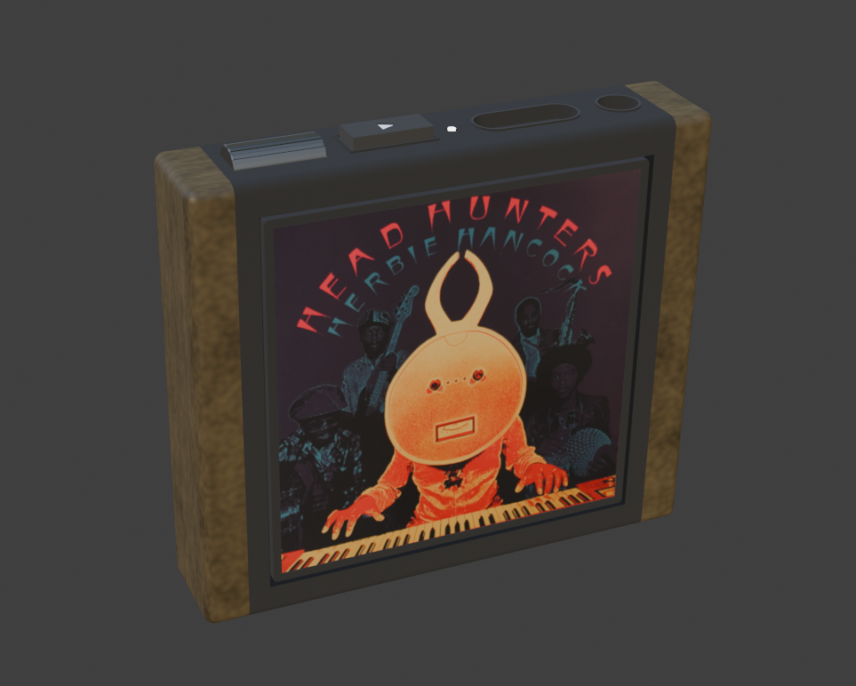
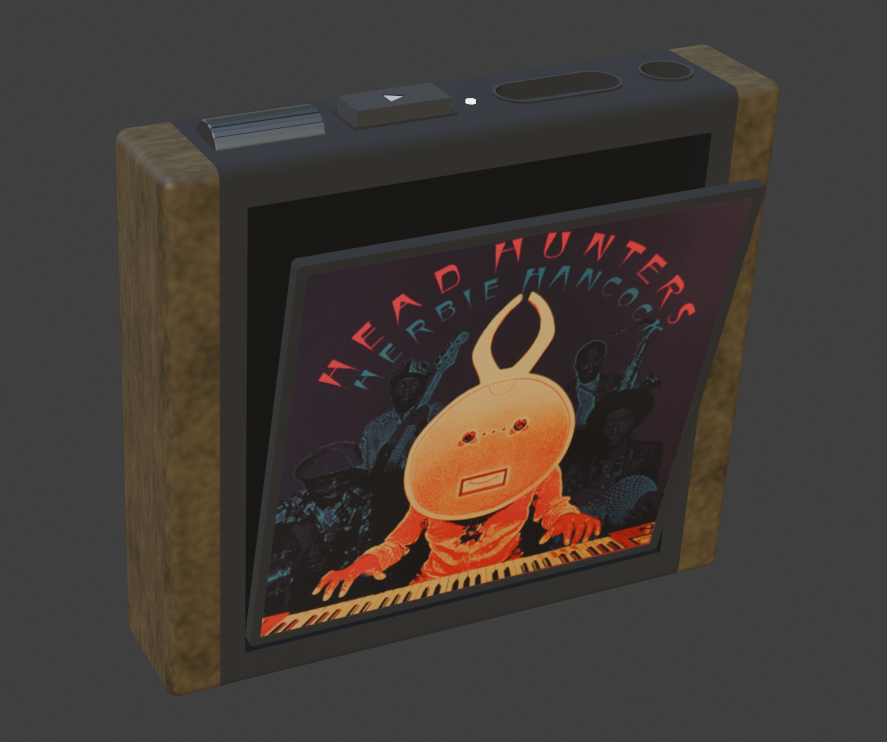
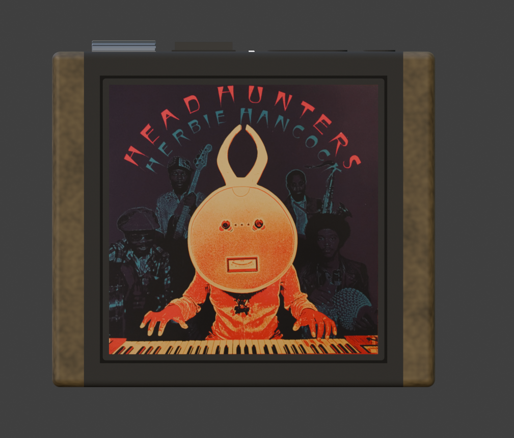
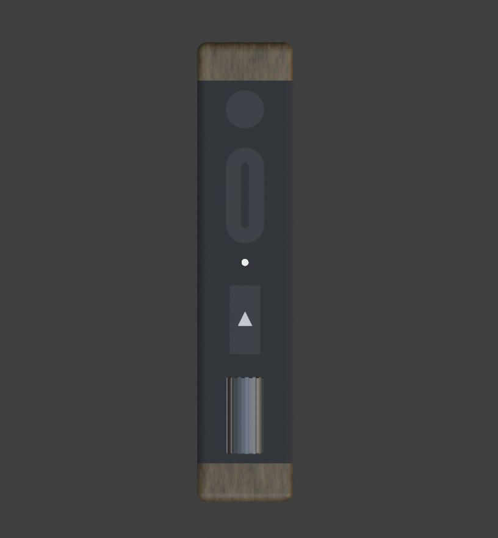

# Prototype 1

Submit initial concepts for your first prototype. These may be sketches, inspiration images, LEGO models -- whatever gets the idea across.

More visual aspects where incorporated than there typically should be for a low fidelity prototype because the look and feel are one of the most important aspects of the device.

_Overview of the device_

_Changing out an album_

_Front view_

_Top view. Top to bottom: headphone jack, usb-c for charging or audio out, led power indicator (white for 30% - 100%, yellow for 10% - 30%, red for 0% - 10%, only lights up when interacting with the device), play button (push the button down to play, push again to move the button up and pause), volume wheel_
